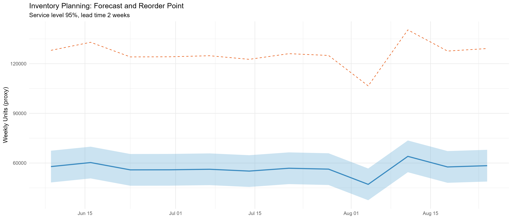
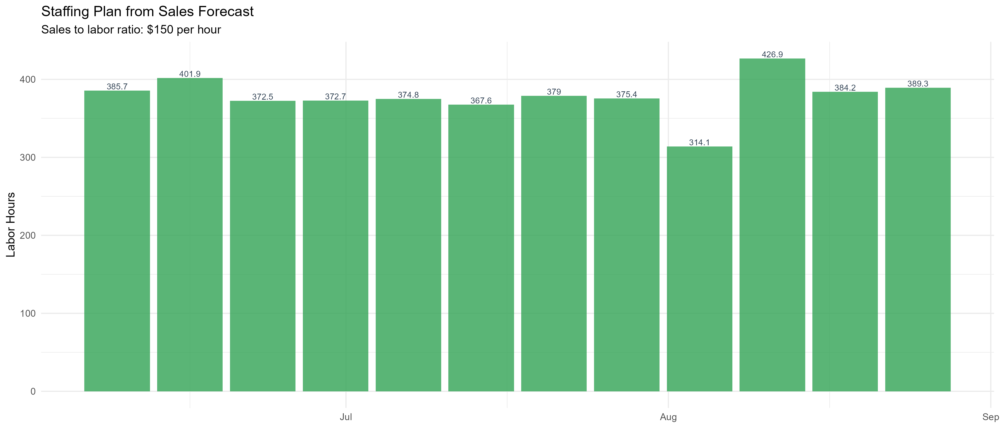

# Operations Planning: Inventory and Staffing

- Residual SD: 5314.67; Service Level: 95%; Lead Time: 2 weeks.
- Safety Stock (per week proxy): 12362.84.
- Sales to Labor Ratio: $150 per hour.

## Visuals

## Notes
- Units proxy assumes proportionality of sales and demand; calibrate with item-level data.
- Adjust service level, lead time, and sales-to-labor ratio to your operation.
- For SKU/store optimization, run hierarchical forecasts and compute per-node buffers.

## Plain-English Summary
- Safety stock is a small buffer to avoid stockouts during normal ups and downs.
- We assume your supplier takes 2 weeks; reorder points include expected sales during lead time plus a buffer.
- Staffing converts forecasted sales into labor hours using a simple ratio ($150 per hour); adjust to your store.
- Use higher service levels if you prefer fewer stockouts, but expect more inventory on hand.
